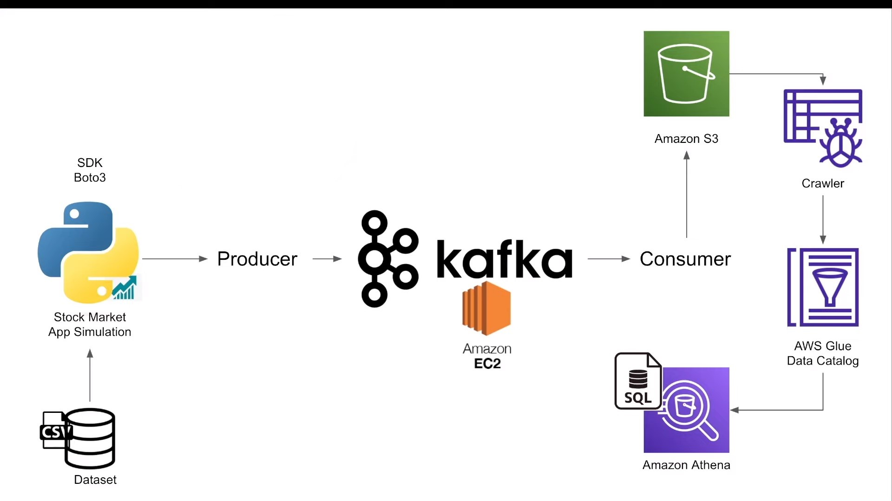
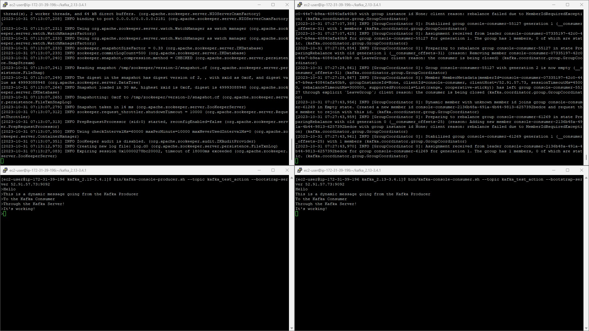
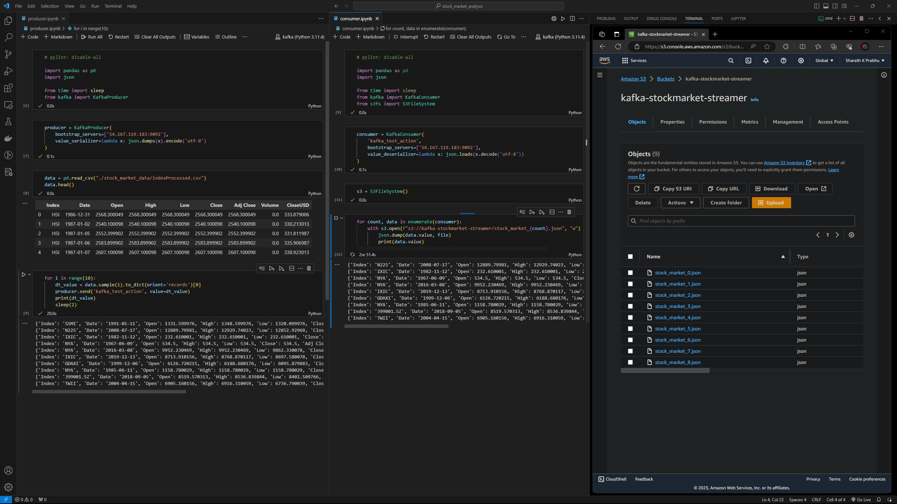
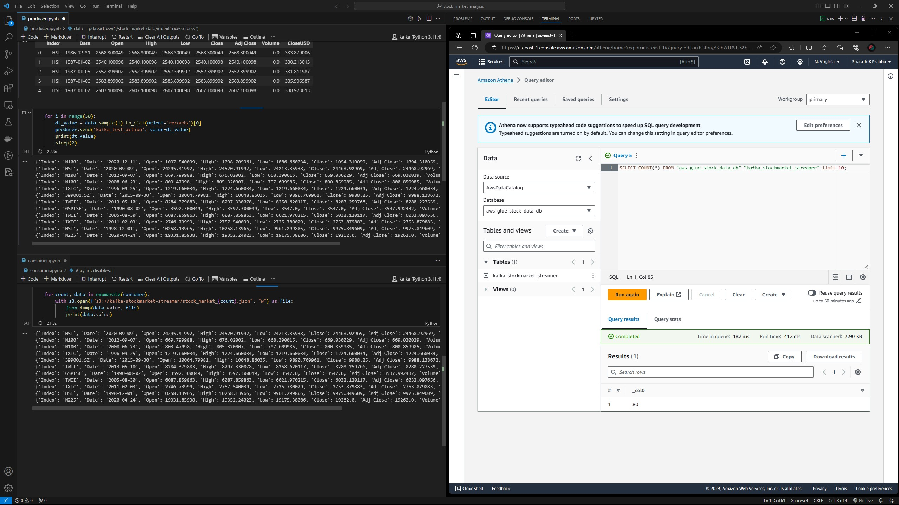

# __Real-time stock market analysis using Kafka__

## __Introduction__
This project implements an End-To-End Data Engineering Project on Real-Time Stock Market Data using Kafka.

  

 

An __Apache Kafka Server__ is setup along with a __Apache Zookeeper__ fetch and monitor the dynamically rendering data.

  

 

The real-data production is simulated using __Python__. We can also setup a an API that produces real-time stock market data.

  

 

The data is stored on the __AWS S3 Bucket__ and crawled using __AWS Glue Crawler__.

  

 

## __Technologies Used__
- __Python__
- __Amazon Web Service (AWS)__
  1. S3 (Simple Storage Service)
  2. Athena
  3. Glue Crawler
  4. Glue Catalog
  5. EC2
- __Apache Kafka__

## __Dataset__

We can use any dataset. The project mainly focuses on the operational side of Data Engineering (building data pipeline).

I have used a stored-static data saved as a [CSV File](./stock_market_data/indexProcessed.csv).

## __Implementation__

Follow the [ScreenShots](./ScreenShots/) for implementation.

The [commands.txt](./commands.txt) file provides all instructions to create the Kafka Server.
